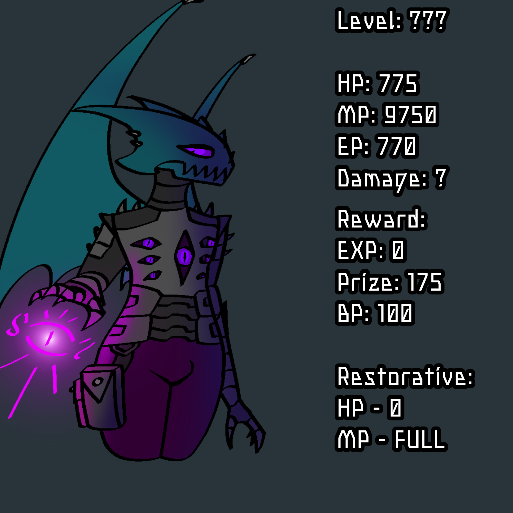

<head>   
    <title>Cursidk Lair</title>

 <body background="i (19).png"></body>
    
<html>

  <title>Вики по лору игры</title>

<body>
  <h1>Wiki Cursidk Lair</h1>

  
 

    <table>
  <caption style="text-align: center;color: white;font-size: 37px;">курсидия</caption>
    <thead>
 <tr>
        <th style="background-color: #1f1f1f;"></th>
        <th style="text-align: center;color: white;background-color: #1f1f1f;"></th>
        <th style="background-color: #1f1f1f;"></th>
      </tr>
      
 </thead>
    <tbody>
      <tr>
        <td style="background-color: #1f1f1f;">  </td>
        <td style="text-align: center;background-color: #1f1f1f;color: white;"> Автор:дуся </td>
        
   </tr>
      <tr>
        <td style="background-color: #1f1f1f;"></td>
        <td style="text-align: center;background-color: #1f1f1f;color: white;"><b>Статистика:</b></td>
        <td style="background-color: #1f1f1f;"></td>
      </tr>
      <tr>
  <td style="background-color: #1f1f1f;"></td>
 <td style="text-align: center;background-color: #1f1f1f;color: white;">(В разработке)</td>
 <td style="background-color: #1f1f1f;"></td>
  </tr>
 <tr>
 <td style="background-color: #1f1f1f;"></td>
  <td style="text-align: center;background-color: #1f1f1f;color: white;"><b>LEVEL:</b></td>
   <td style="background-color: #1f1f1f;"></td>
  </tr>
      
 <tr>
 <td style="background-color: #1f1f1f;"></td>
  <td style="text-align: center;background-color: #1f1f1f;color: white;">HP:775 MP:9750 AP:770 BP:100</td>
 <td style="background-color: #1f1f1f;"></td>
 </tr>
  

      <tr>
        <td style="background-color: #1f1f1f"></td>
        <td style="text-align: center;background-color: #1f1f1f;color: white;"><b>Душа:</b></td>
        <td style="background-color: #1f1f1f;"></td>
      </tr>
      <tr>
        <td style="background-color: #1f1f1f;"></td>
        <td style="color: white;background-color: #1f1f1f;">Дата смерти:</td>
        <td style="background-color: #1f1f1f;"></td>
      </tr>
      <tr>
        <td style="background-color: #1f1f1f;"></td>
        <td style="color: white;background-color: #1f1f1f;">Пол:</td>
        <td style="background-color: #1f1f1f;"></td>
      </tr>
      <tr>
        <td style="background-color: #1f1f1f"></td>
        <td style="color: white;background-color: #1f1f1f;">Принадлежность:</td>
        <td style="background-color: #1f1f1f;"></td>
      </tr>
      <tr>
        <td style="background-color: #1f1f1f;"></td>
        <td style="color: white;background-color: #1f1f1f;">Дебют:</td>
        <td style="background-color: #1f1f1f;"></td>
      </tr>
      <tr>
        <td style="background-color: #1f1f1f;"></td>
        <td style="color: white;background-color: #1f1f1f;">Титулы:</td>
        <td style="background-color: #1f1f1f;"></td>
      </tr>
      <tr>
        <td style="background-color: #1f1f1f;"></td>
        <td style="color: white;background-color: #1f1f1f;">Роль:</td>
        <td style="background-color: #1f1f1f;"></td>
      </tr>
      <tr>
        <td style="background-color: #1f1f1f;"></td>
        <td style="color: white;background-color: #1f1f1f;">Отношения/Связи:</td>
        <td style="background-color: #1f1f1f;"></td>
      </tr>
      <tr>
        <td style="background-color: #1f1f1f;"></td>
        <td style="color: white;background-color: #1f1f1f;">Силы и способности::</td>
        <td style="background-color: #1f1f1f;"></td>
      </tr>
    </tbody>
    <tfoot>
      <tr>
        <td style="background-color: #1f1f1f;"></td>
        <td style="color: white;background-color: #1f1f1f;">Оружие:</td>
        <td style="background-color: #1f1f1f;"></td>
      </tr>
      </tfoot>
      </table>
      
 

